## WorkShop Buddy
App is hosted here - https://workshopbuddy.herokuapp.com/

## Introduction
A joint project with my classmates, Ken Wong & Dave Li. Made using React & Express. This app enables users to keep track of their vehicle maintainance records, make appointments with workshops.
It also enables workshops to accept appointments, keep records of their customers and vehicle service history, to enable easier rectification of problems.

## TechStack
- React
- React-Bootstrap
- MongoDB
- Axios
- Express

## Features
- User is able to input a vehicle
- User is able to make appointments. And await for appointment confirmation
- Workshop user is able to accept incoming appointments
- Workshop user is able to complete current jobs and it will be a part of the vehicle service history

## Further Possible Improvements
- Minor bug fixes
 - Login & Register pages.
 - Vehicle entries need to be specific to a registration number.

Login Screen
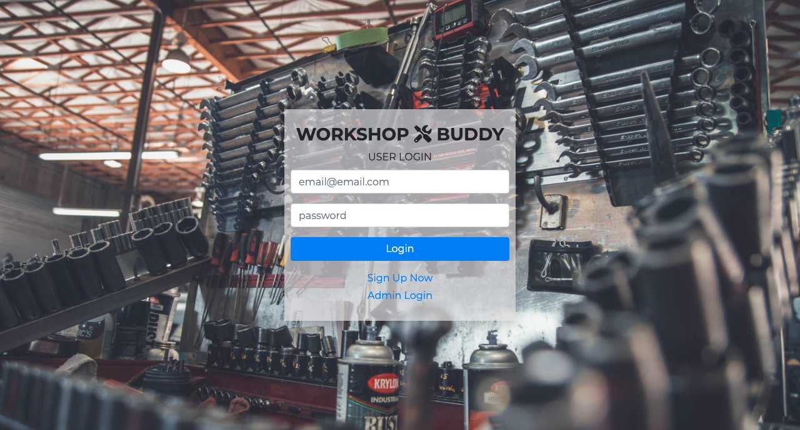
User Dashboard
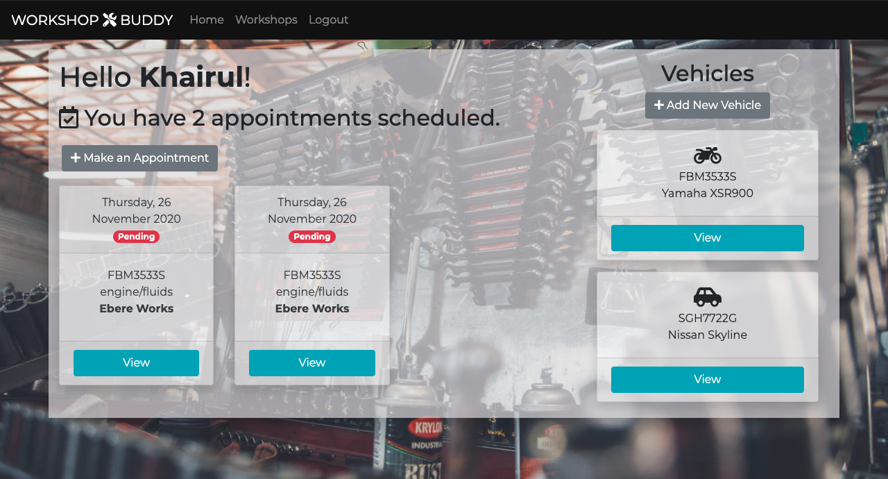
User Vehicles
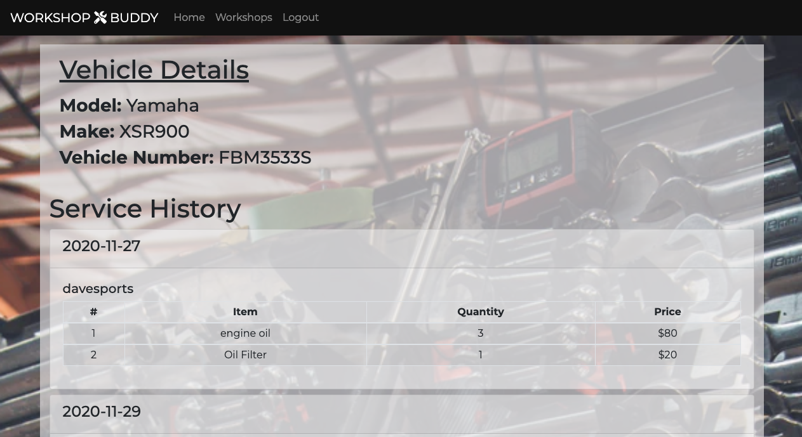
Workshops Available
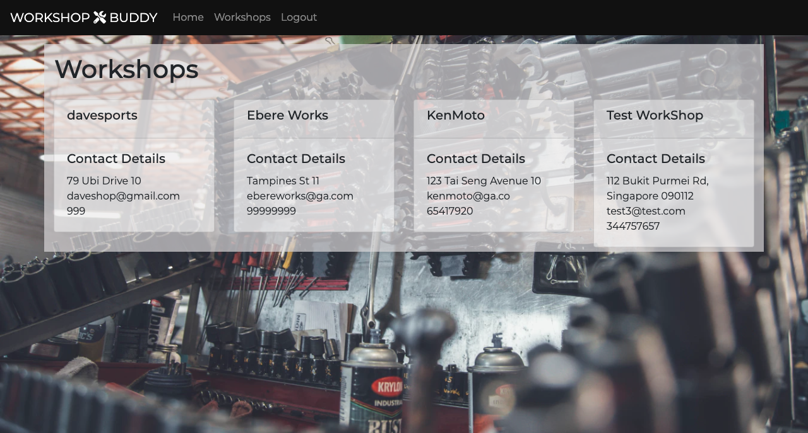
Make Appointment
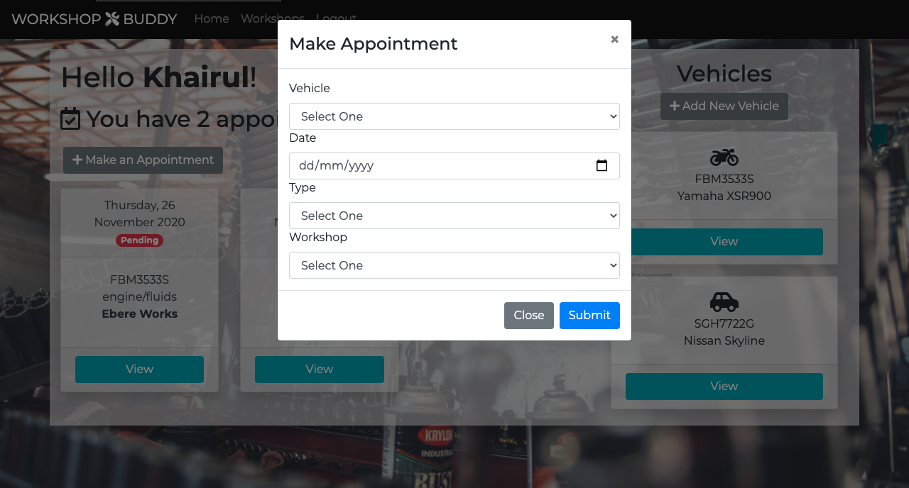

Workshop Dashboard
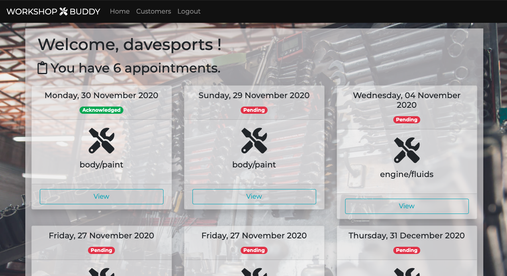
Workshop Customers
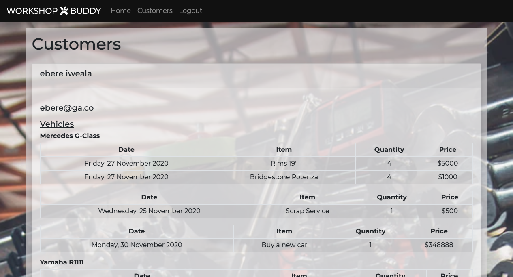
Workshop Appointments
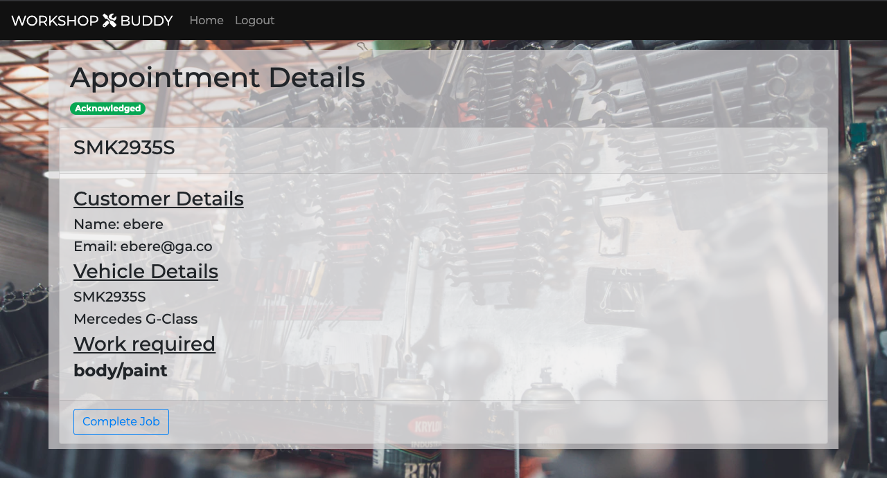
Complete Job
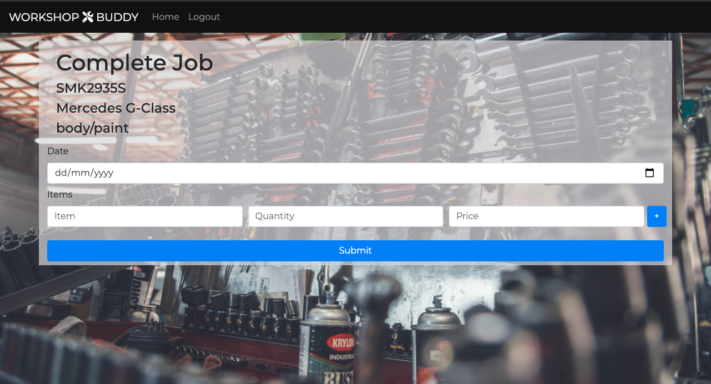

## WireFrame
### login
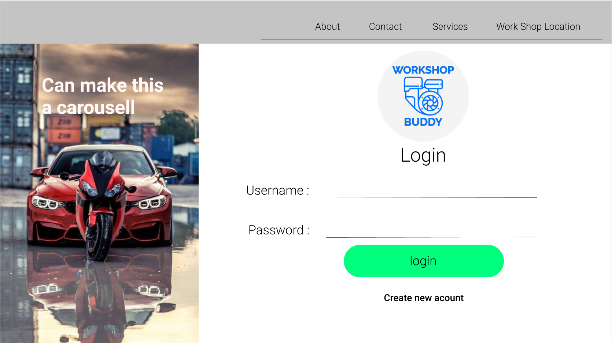
### Register page
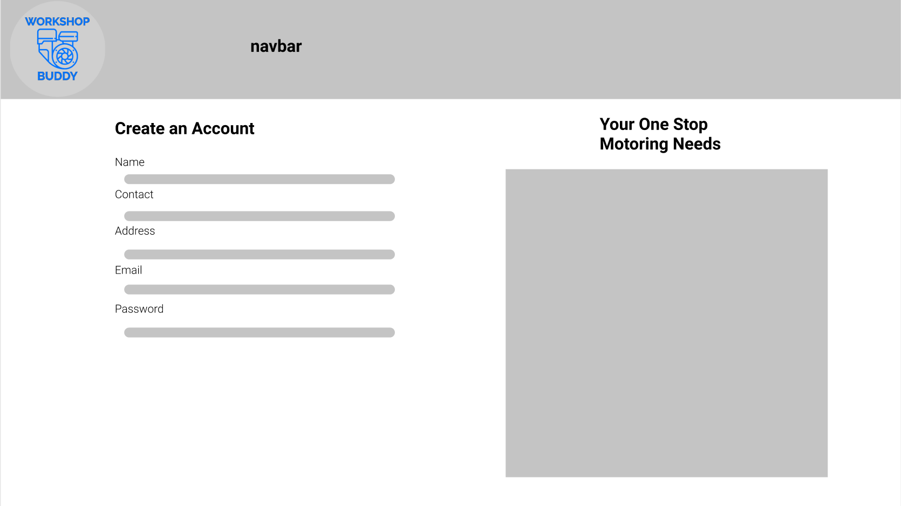
### Vehicle Home page
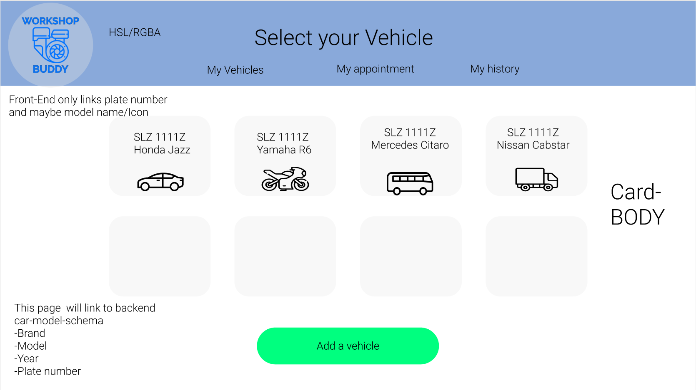
### Add a vehicle
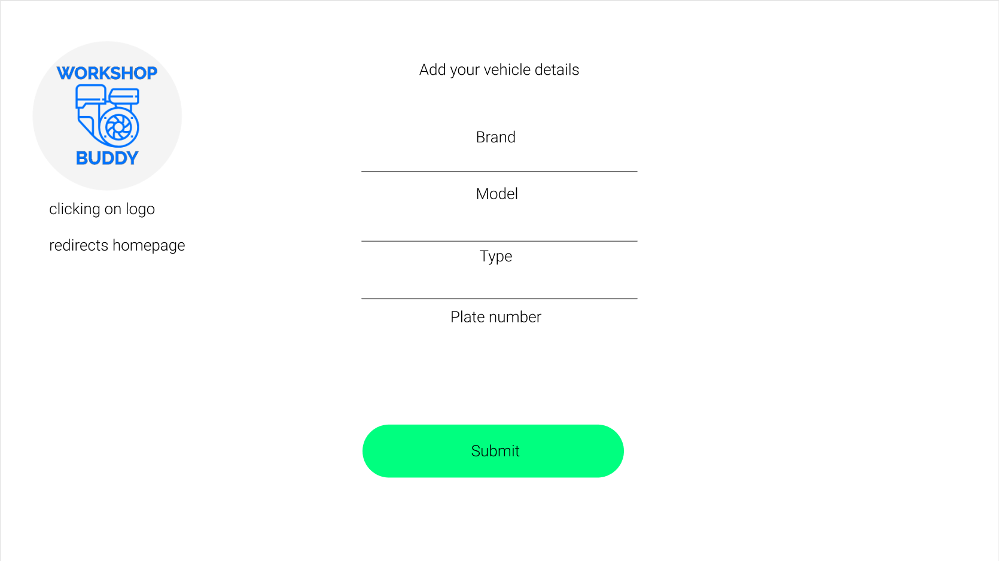
### Select services for vehicle
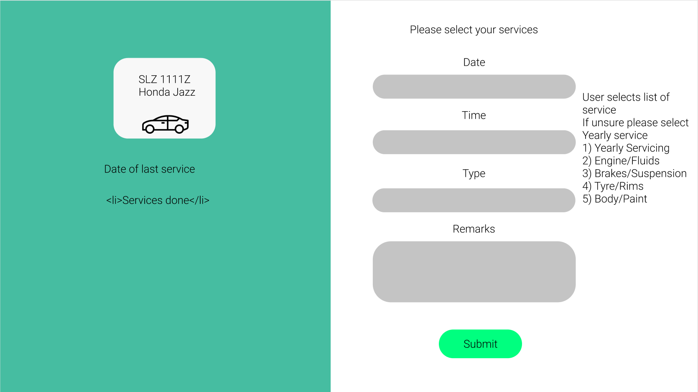
### Flash confirmation
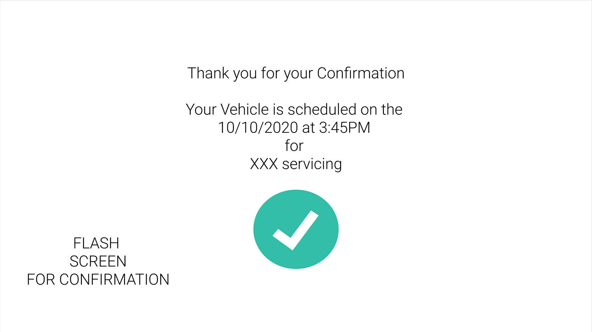

